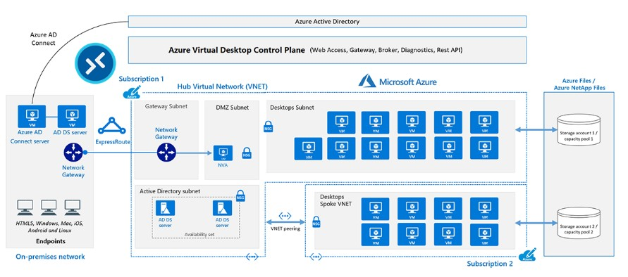

# Azure Virtual Desktop

- Azure Virtual Desktop (AVD) is a desktop and application virtualization service that runs in Azure cloud.

- AVD works across devices (Windows, MAC, Linux, iOS and Android) with apps that you can use to access remote desktops and apps.

- Below is an example of AVD infra architecture: 

- The diagram above shows a typical architectural setup for Azure Virtual Desktop.

- The application endpoints are in the customer's on-premises network. ExpressRoute extends the on-premises network into the Azure cloud, and Azure AD Connect integrates the customer's Active Directory Domain Services (AD DS) with Azure Active Directory (Azure AD).

- The Azure Virtual Desktop control plane handles Web Access, Gateway, Broker, Diagnostics, and extensibility components like REST APIs.

- The customer manages AD DS and Azure AD, Azure subscriptions, virtual networks, Azure Files or Azure NetApp Files, and the Azure Virtual Desktop host pools and workspaces.

- To increase capacity, the customer uses two Azure subscriptions in a hub-spoke architecture, and connects them via virtual network peering.